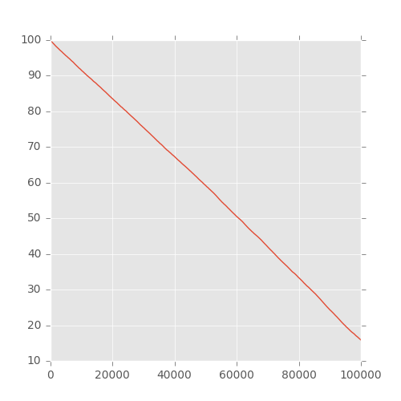

## Perceptron

## Files:
+ `matplot-reporter.py` - visualizer for error rate (reads from `matplot-text.txt` log)
+ `mnist-perceptron.py` - MNIST perceptron

Obs:
+ perceptron implementations - no framework
+ tensorflow implementation - you have to run:
  + `python tensorflow_mnist.py` or unpack tensorflow_mnist_logs.zip, and check the data
  + `tensorboard --logdir=mnist_logs`

### Error rate (< 0.2)

